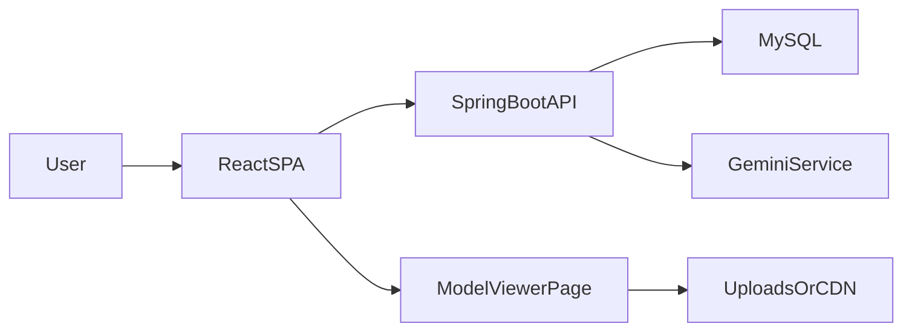

## Suhada Furniture (Full‑Stack + AI + Web AR)

### 30‑second pitch
Suhada is a full‑stack furniture platform (React + Spring Boot + MySQL) with **Web AR**: users can open a product in **3D**, then place it in their real room using **AR** (Android Scene Viewer / iOS Quick Look / WebXR when available). It also includes an **AI product finder** backed by Gemini, hardened with rate limiting, caching, and reliability controls.

### Key highlights (what makes it “production-grade”)
- **Web AR integration**: storefront CTA (“View in 3D / View in AR”) deep-links into a dedicated viewer with `model-viewer` and `?mode=ar` auto-launch.
- **Secure 3D uploads**: 3D model upload/delete endpoints are restricted to STAFF/ADMIN, not public.
- **Secrets hygiene**: no credentials committed; backend reads secrets from environment variables.
- **Scalable asset URLs**: versioned, content-hashed `.glb` filenames to avoid stale caches and enable rollbacks.
- **DB migrations + indexing**: Flyway migration adds indexes for common query paths.
- **AI reliability**: timeouts, caching, and a simple circuit breaker to protect latency and cost.

### Demo flow (record this as a 45–60s video)
1. Open `/products` → pick a product that has an **AR** badge.
2. On product detail, click **View in AR** (mobile) or **View in 3D** (desktop).
3. In viewer, show model loading, rotate/zoom.
4. Tap **View in AR** → place in room.
5. Tap **Save Placement Snapshot** → show that snapshots are stored (local demo feature).

### Architecture (talk track)
- **Frontend**: React (Vite), React Router, Zustand, Axios API client.
- **Backend**: Spring Boot (JWT auth), REST APIs, Thymeleaf viewer page for `model-viewer`.
- **DB**: MySQL via JPA/Hibernate, with Flyway migrations for index management.
- **AI**: Gemini integration for intent extraction + product ranking with fallbacks and caching.
- **3D/AR assets**: uploads stored under `file.upload-dir`, served via `/uploads/**`, with content-hashed filenames and `file.base-url` support for CDN fronting.

### Resume bullets (choose 3–5)
- Built a full‑stack furniture platform (**React + Spring Boot + MySQL**) with **Web AR** product visualization using `model-viewer` (Scene Viewer / Quick Look / WebXR) and deep‑linked AR launch.
- Designed a secure 3D asset pipeline: restricted upload/delete APIs to STAFF/ADMIN, removed hardcoded secrets, and centralized CORS via Spring Security.
- Implemented **versioned, content‑hashed 3D model URLs** to eliminate stale caching and enable safe rollbacks.
- Added **Flyway** migrations and production indexing strategy for key product/order query paths.
- Hardened Gemini-backed AI product finder with **timeouts, caching, and circuit breaker behavior** plus rate limiting to prevent abuse/cost spikes.

### Interview “why” answers (quick)
- **Why keep the AR viewer as a separate page?** Fast, reliable integration that proves AR value quickly; architecture supports later embedding into React or a native app by keeping model URLs + asset pipeline stable.
- **Biggest production risk you fixed?** Public 3D upload/delete + secrets committed; both are common real-world mistakes and high-impact.
- **Scalability story?** CDN-fronted assets via `file.base-url`, immutable hashed filenames, and DB indexes + migration discipline.

